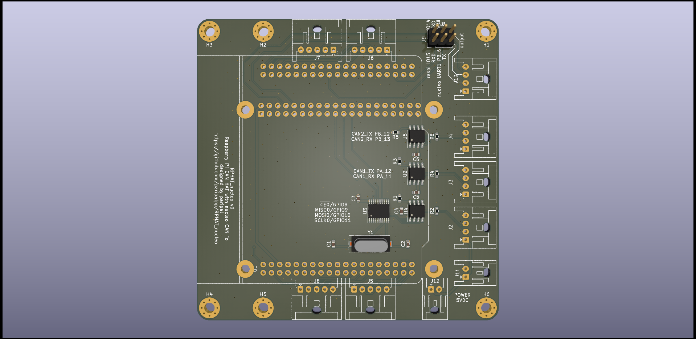

# RPHAT_nucleo

# connector
|Connector|pin number|nucleo pin|
|---|---|---|
J5|1|PC_0
J5|2|PC_1
J5|3|PC_2
J5|4|PC_3
J5|5|GND
J6|1|PC_4
J6|2|PC_5
J6|3|PC_6
J6|4|PC_7
J6|5|GND
J7|1|PC_8
J7|2|PC_9
J7|3|PC_10
J7|4|PC_11
J7|5|GND
J8|1|PC_12
J8|2|PC_13
J8|3|PC_14
J8|4|PC_15
J8|5|GND
## LISENCE
 This work is licensed under a <a rel="license" href="http://creativecommons.org/licenses/by/4.0/">Creative Commons Attribution 4.0 International License</a>.
 この 作品 は <a rel="license" href="http://creativecommons.org/licenses/by/4.0/">クリエイティブ・コモンズ 表示 4.0 国際 ライセンス</a>の下に提供されています。
